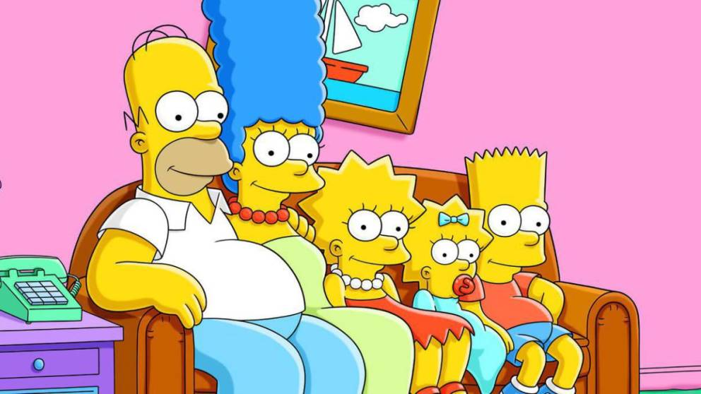
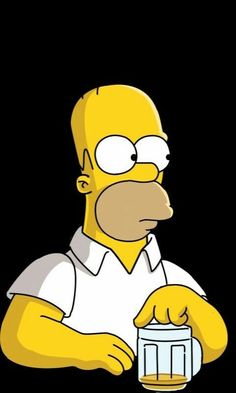

# PROYECTO-FILTRO_VELANDIA_LUIS
Este proyecto tiene colores relacionados a la serie que se le esta realizando la pagina 
las fotos son relacionadas a personajes, capitulos y temporadas destacadas de la serie
la informacion contenida en el proyecto  es relacionada de datos y mas paginas web consultadas mas no es copiada de ninguna web 
es de mi autoria y creada con HTML y CSS, evidenciando los conocimientos adquiridos y consultas googleadas de partes del codigo
el diseño es de mi autoria junto con la colorimetria en el proyecto

# En la parte superior de la pagina  encuentramos
un menu el cual redirecciona a diferentes partes de la misma pagina,
este menu es transparente con letras en color relacionado a la serie y de fondo transparente para no intervenir forzosamente en las demas partes de la pagina
se continua con div con un breve resumen de la tematica en conjunto con la foto de homero simpson el cual es el personaje mas popular de la serie al aparecer en casi la totalidad de la serie

junto con la titulacion "The Simpsons" en la tipografia mas similar y en el color representativo del color de Marge Simpson el cual es el azul de su cabello
se continua  con un breve resumen de la historia de los simpsons junto a un mapa ubicado mas abajo de manera semantica y a la izquierda de la pántalla: este continene informacion relevante acerca de su creador, el año en el que se creacion y demas datos.
se continua mas abajo con la informacion de su creador Matt Groening, con informacion relevante junto a una imagen de Matt en vida y una representacion en forma de personaje de los simpsons
y esto se ubica  a mano derecha,  a la izquierda y un poco mas abajo se ubican las predicciones de la serie, las cuales son de gran controversia puesto que hacen referencias a momentos y hechos historicos que han sucedido años despues de haberse lanzado al aire en temporadas pasadas.

de manera descendente continuamos con la seccion de los 5 personajes principales de la serie los cuales son la familia Simpson
iniciando con Homer y dando un breve resumen de lo que es su personje
luego continuamos con Marge  y su informacion mas importante
dandole paso a Bart el varon e hijo mayor de la familia
continuando con lisa el personaje mas inteligente de la familia amarilla
y finalizando con Maggie la bebe e hija menor de la familia la cual destaca en ciertos capitulos con sus acciones o con el sonido de su chupon
y finalizando con una lista de las mejores temporadas que a tenido la serie las cuales han sido escogidas por  las personas y fanaticos mas dedicados 

## ALGUNAS DE LAS IAMGENES DEL PROYECTO 

> [!NOTE]
>Esto es la imagende la familia mas conocida de la television a nivel mundial

> [!NOTE]
>Esto es la imagen del personaje mas conocido de la familia mas conocida de la television a nivel mundial

> [!IMPORTANT]  
> Esto es información importante este proyecto tuvo un desarrollo corto y se realizo con la finalidad de afinazar y evaluar conocimientos adquiridos en HTML y CSS
> El tema fue de eleccion libre
> Elaboro Luis Felipe Velandia Llanes
